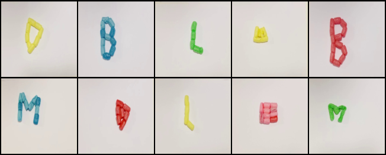
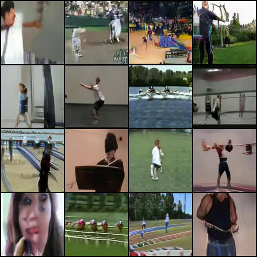
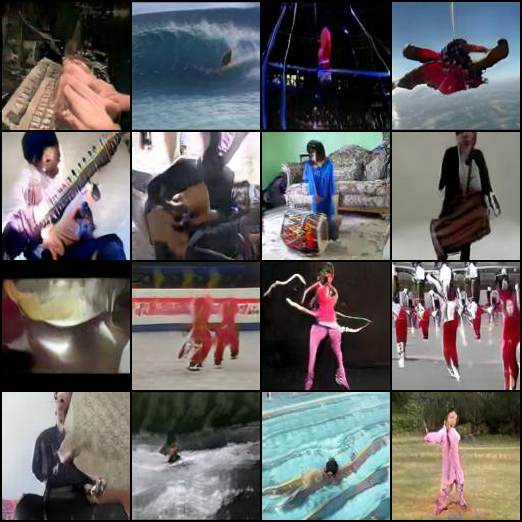

# Temporal Shift GAN for Large Scale Video Generation

This repository contains the official Pytorch implementation of Temporal Shift GAN for Large Scale Video Generation. Further details can be found here: https://arxiv.org/abs/2004.01823

To reproduce results download the pre-trained weights, then start training.

Pre-trained ImageNet weights: https://drive.google.com/open?id=1QvbsuhVB036wbtc4pKJRHhli0q_eOUGn

## Usage

To use any dataset you should  extract the frames of all videos and create a .txt file with three columns in this exact order: Location of the frames of the video, Number of frames in the folder and Class it belongs to.

### Train
Run the script run_video_gan.sh.

### Test
The script run create_dataset.sh will automatically create N videos of each class on the dataset.

## Architecture

## Samples

### MaisToy Real Samples
[(https://drive.google.com/file/d/1a_yAMwfQtQ4hKA22UbAZhPPKBw4ttVNU/view?usp=sharing "MaisToy")

### UCF-101 (Click for video)

### 20BN-Jester

### Weizmann

