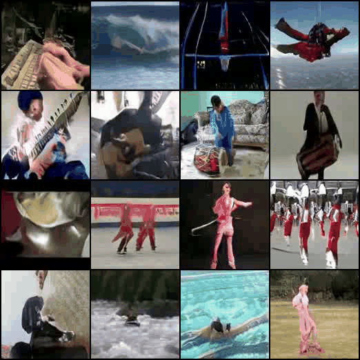
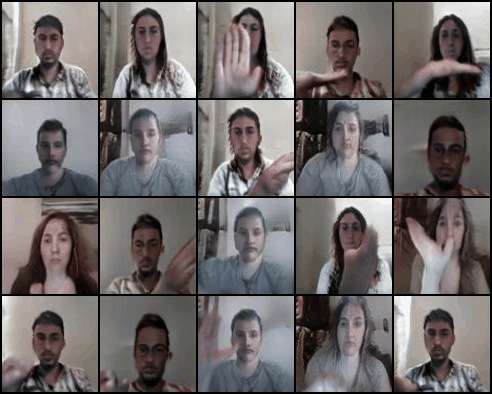

# MVT-GAN

This repository contains the official Pytorch implementation of Multi-Variate Temporal GAN for Large Scale Video Generation. Further details can be found here: https://arxiv.org/abs/2004.01823

To reproduce results download the pre-trained weights, then start training.

Pre-trained ImageNet weights: https://drive.google.com/open?id=1QvbsuhVB036wbtc4pKJRHhli0q_eOUGn

To train the network run the script run_video_gan.sh.

To test results run create_dataset.sh.

## Samples

### UCF-101
 

### 20BN-Jester

### Weizmann

